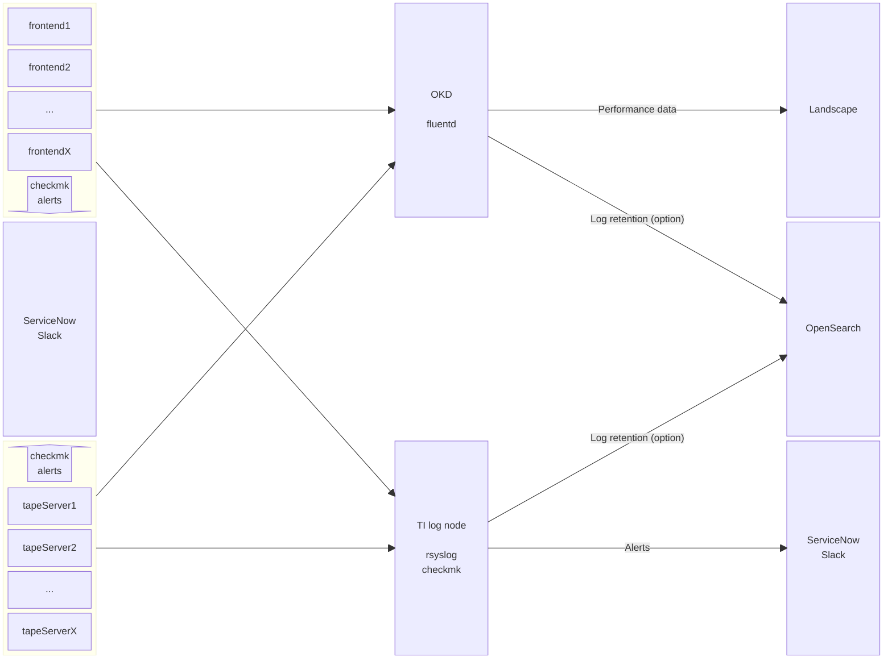

```mermaid
block-beta
  columns 9

  block:FE
  columns 1
  frontend1 
  frontend2  
  fei["..."]
  frontendX
  checkmk_fe<["checkmk<br>alerts"]>(down)
  end

  
  space:3

  okd["OKD<br><br>fluentd"]

  space:3

  Landscape

  local_alerts["ServiceNow<br>Slack"]
  space:3
  space
  space:3
  OpenSearch

  block:TS
  columns 1
  checkmk_ts<["checkmk<br>alerts"]>(up)
  tapeServer1 
  tapeServer2 
  tsi["..."] 
  tapeServerX  
  end
  space:3
  checkmk["TI log node<br><br>rsyslog<br>checkmk"]
  space:3
  global_alerts["ServiceNow<br>Slack"]

  FE  -->okd 

  FE  -->checkmk 
  TS -->okd 

  TS  -->checkmk 
  okd-- "Performance data " --> Landscape

  
  okd-- "Log retention (option)" --> OpenSearch
  checkmk-- "Log retention (option)" --> OpenSearch

  checkmk-- "Alerts" --> global_alerts
  
```
