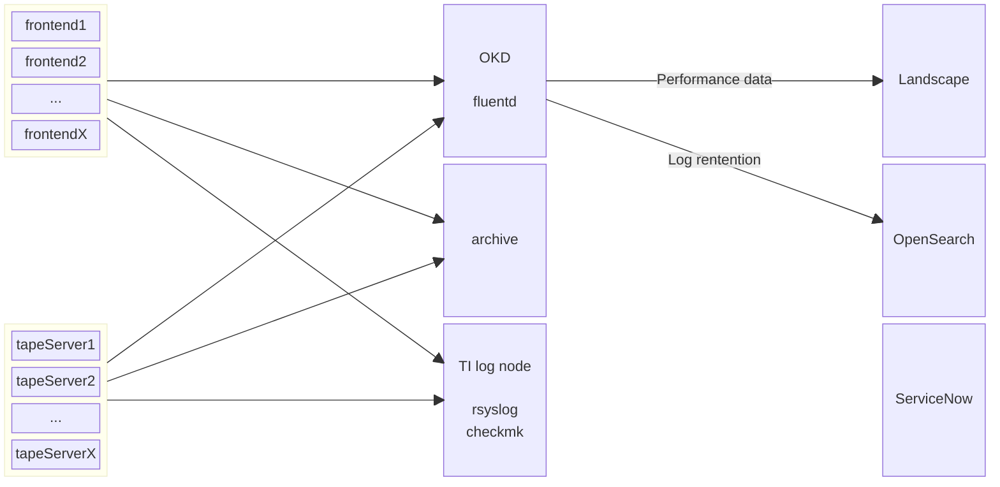

```mermaid
block-beta
  columns 9

  block:FE
  columns 1
  frontend1 
  frontend2  
  fei["..."]
  frontendX  
  end

  space:3

  okd["OKD<br><br>fluentd"]

  space:3

  Landscape

  space:4
  archive
  space:3
  OpenSearch

  block:TS
  columns 1
  tapeServer1 
  tapeServer2 
  tsi["..."] 
  tapeServerX  
  end
  space:3
  checkmk["TI log node<br><br>rsyslog<br>checkmk"]
  space:3
  ServiceNow

  FE  -->okd 
  FE  -->archive 
  FE  -->checkmk 
  TS -->okd 
  TS -->archive 
  TS  -->checkmk 
  okd-- "Performance data " --> Landscape
  okd-- "Log rentention" --> OpenSearch
```
