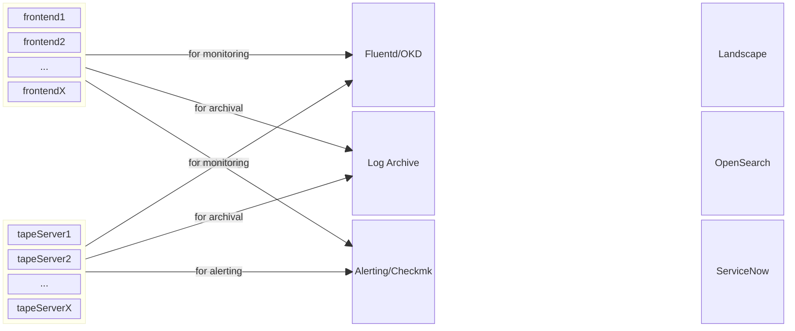

```mermaid
block-beta
  columns 9

  block:FE
  columns 1
  frontend1 
  frontend2  
  fei["..."]
  frontendX  
  end

  space:3

  fluent["Fluentd/OKD"]

  space:3

  Landscape

  space:4
  archive["Log Archive"]
  space:3
  OpenSearch

  block:TS
  columns 1
  tapeServer1 
  tapeServer2 
  tsi["..."] 
  tapeServerX  
  end
  space:3
  checkmk["Alerting/Checkmk"]
  space:3
  ServiceNow

  FE-- "for monitoring" -->fluent 
  FE-- "for archival" -->archive 
  FE--  "for alerting" -->checkmk 
  TS-- "for monitoring" -->fluent 
  TS-- "for archival" -->archive 
  TS-- "for alerting" -->checkmk 

```
